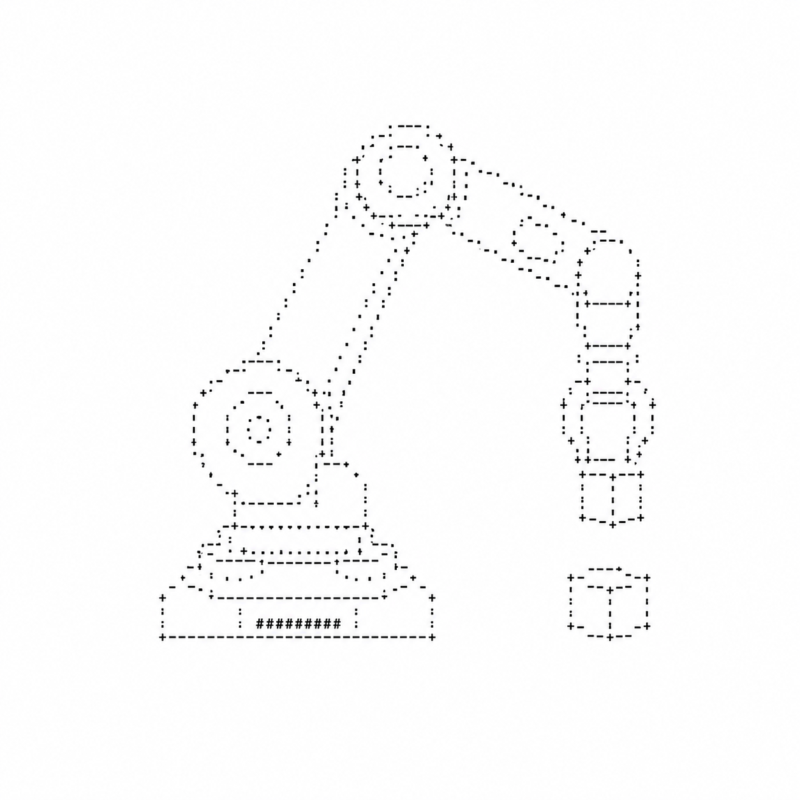
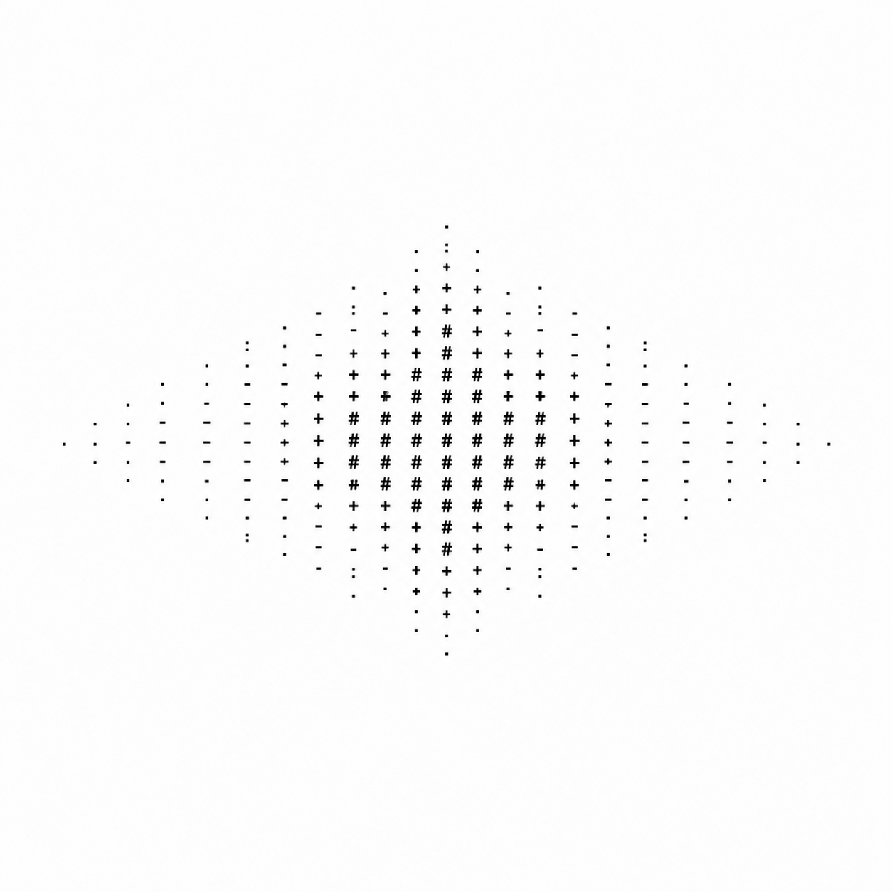
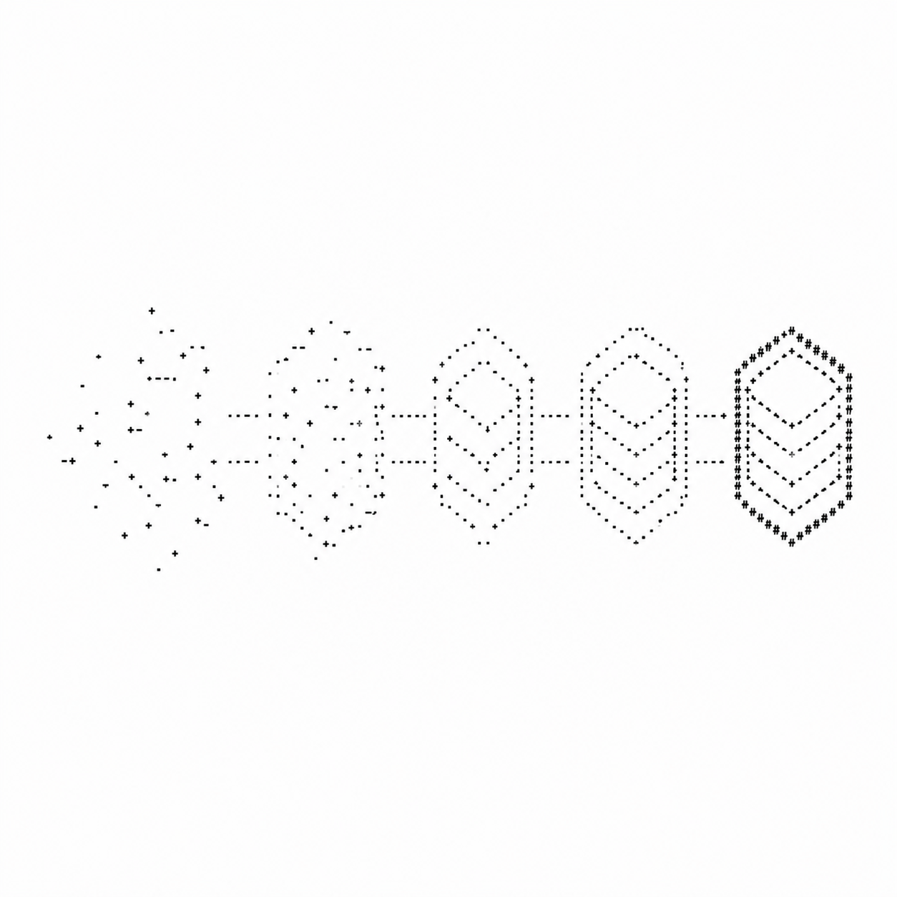
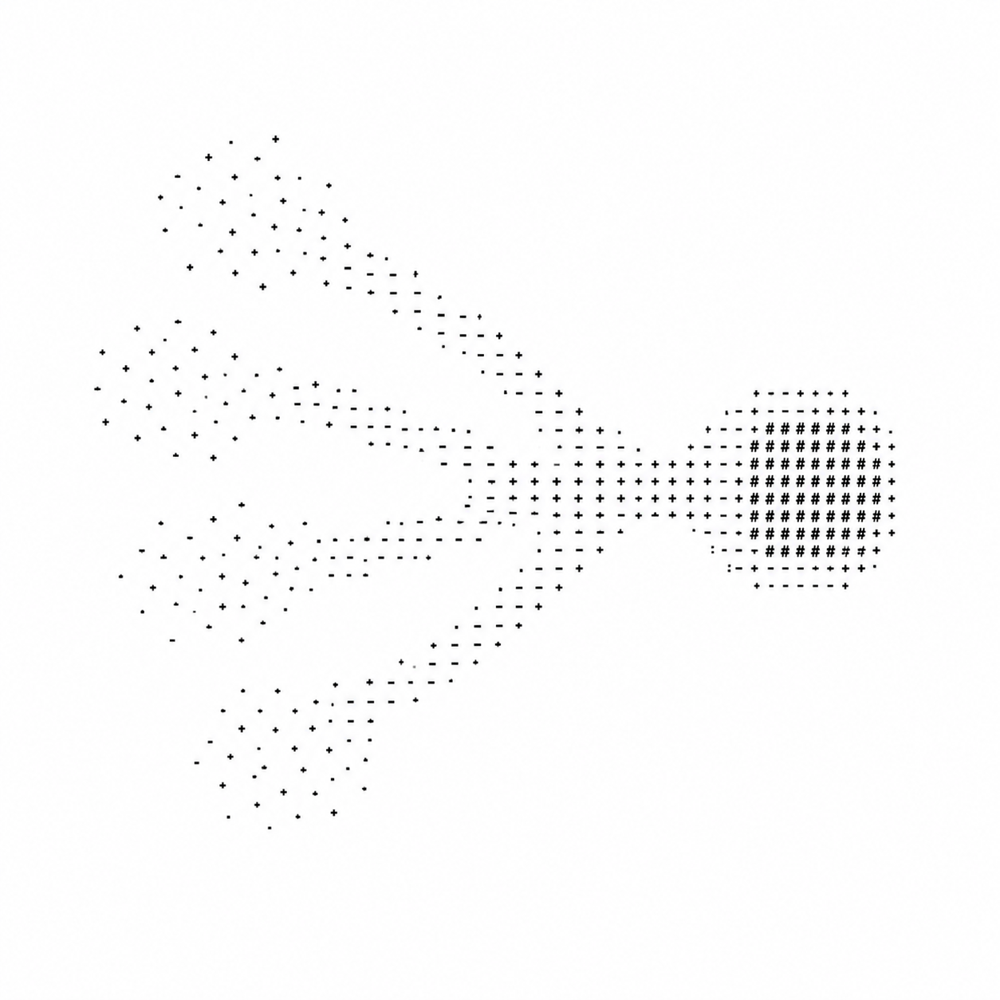

<table width="100%">
<tr>
<td width="65%" valign="top">
<h1>Hello, I'm Shivamsh 👾</h1>
<p>
I'm a Robotics undergrad who believes the best code is the kind you don't have to explain.
I enjoy building things that sit at the intersection of software and the physical world from
AI systems to robots that run across your desk.
</p>
<p>
I care about clean systems, minimal interfaces, and not making future-me suffer.
Currently deep in robotics, LLM tooling, and anything that blurs the line between
software and the real world.
</p>
<p>Always learning in public. Always shipping.</p>
</td>
<td width="29.25%" rowspan="2" align="center" valign="top">

</td>
</tr>
<tr>
<td width="65%" valign="bottom">
<div style="display:flex; justify-content:space-between; align-items:flex-end; gap:16px; width:100%;">
<div>
<b>Connect with me:</b><br/><br/>
<a href="https://www.linkedin.com/in/shivamsh-s-r-4942742a3/"></a>
<a href="mailto:shivamshsr@gmail.com"></a>
<a href="https://github.com/shiv207"></a>
<a href="https://x.com/RShivamsh"></a>
</div>
<div style="white-space:nowrap;">

</div>
</div>
</td>
</tr>
</table>


# Tech Stack

**Languages & Frameworks**
<p align="left">
<a href="https://en.cppreference.com/w/c"></a>
<a href="https://www.python.org/"></a>
<a href="https://developer.mozilla.org/en-US/docs/Web/JavaScript"></a>
<a href="https://www.typescriptlang.org/"></a>
<a href="https://kotlinlang.org/"></a>
<a href="https://reactjs.org/"></a>
<a href="https://nextjs.org/"></a>
<a href="https://developer.mozilla.org/en-US/docs/Web/HTML"></a>
</p>

**AI / ML**
<p align="left">
<a href="https://pytorch.org/"></a>
<a href="https://www.tensorflow.org/"></a>
<a href="https://huggingface.co/"></a>
<a href="https://github.com/ml-explore/mlx"></a>
<a href="https://streamlit.io/"></a>
</p>

**Backend & Infrastructure**
<p align="left">
<a href="https://nodejs.org/"></a>
<a href="https://bun.sh/"></a>
<a href="https://www.postgresql.org/"></a>
<a href="https://redis.io/"></a>
<a href="https://www.docker.com/"></a>
</p>

**Tools**
<p align="left">
<a href="https://git-scm.com/"></a>
<a href="https://code.visualstudio.com/"></a>
<a href="https://neovim.io/"></a>
<a href="https://developer.apple.com/xcode/"></a>
<a href="https://developer.android.com/studio"></a>
<a href="https://www.linux.org/"></a>
</p>


# Projects

> ## Projects
>
> <details>
> <summary>&nbsp;Click Here</summary>
>
> <br/>
>
> <table width="100%" style="margin-top:14px; border-collapse:collapse;">
>   <tr>
>     <td width="320" valign="middle" align="center">
>       <a href="https://github.com/shiv207/VLA_simulated_tests">
>         
>       </a>
>     </td>
>     <td valign="middle" style="padding:16px; vertical-align:middle;">
>       <h3 style="margin:0 0 6px 0;">VLA Simulation — MuJoCo + LLM</h3>
>       <p style="margin:0;">
>         A Vision-Language-Action system for the SO-101 robotic arm. Combines MuJoCo physics, Groq (Llama 3) for planning, and Gemini Vision for real-time perception. Achieves ~80% plan success rate on pick-and-place tasks with sub-200ms LLM inference.
>       </p>
>       <div align="right">
>         <a href="https://github.com/shiv207/VLA_simulated_tests">
>           
>         </a>
>       </div>
>     </td>
>   </tr>
> </table>
>
> <table width="100%" style="margin-top:14px; border-collapse:collapse;">
>   <tr>
>     <td width="320" valign="middle" align="center">
>       <a href="https://github.com/shiv207/MLX-voice-assistant">
>         
>       </a>
>     </td>
>     <td valign="middle" style="padding:16px; vertical-align:middle;">
>       <h3 style="margin:0 0 6px 0;">MLX Voice Assistant</h3>
>       <p style="margin:0;">
>         A fully local, privacy-first voice assistant built for Apple Silicon. Uses Whisper for speech recognition and runs Gemma 3 4B (4-bit quantized) via MLX — no cloud calls, no data leaving your device. Wake word: "Travis".
>       </p>
>       <div align="right">
>         <a href="https://github.com/shiv207/MLX-voice-assistant">
>           
>         </a>
>       </div>
>     </td>
>   </tr>
> </table>
>
> <table width="100%" style="margin-top:14px; border-collapse:collapse;">
>   <tr>
>     <td width="320" valign="middle" align="center">
>       <a href="https://github.com/shiv207/AX-0-chain-of-thought-">
>         
>       </a>
>     </td>
>     <td valign="middle" style="padding:16px; vertical-align:middle;">
>       <h3 style="margin:0 0 6px 0;">AX-0: Chain-of-Thought Reasoning Engine</h3>
>       <p style="margin:0;">
>         An open reimplementation of o1-style chain-of-thought reasoning using Gemini's API and a sequential multi-agent architecture. Proposes and iteratively refines solutions through reflection at each stage — built to explore how far smaller models can go.
>       </p>
>       <div align="right">
>         <a href="https://github.com/shiv207/AX-0-chain-of-thought-">
>           
>         </a>
>       </div>
>     </td>
>   </tr>
> </table>
>
> <table width="100%" style="margin-top:14px; border-collapse:collapse;">
>   <tr>
>     <td width="320" valign="middle" align="center">
>       <a href="https://github.com/shiv207/Deepsearch-clone-opensource">
>         
>       </a>
>     </td>
>     <td valign="middle" style="padding:16px; vertical-align:middle;">
>       <h3 style="margin:0 0 6px 0;">Deepsearch — Open Source Research Agent</h3>
>       <p style="margin:0;">
>         An experimental clone of deep web research tools like Grok-3, built with DeepSeek R1 via Groq and SerpAPI. Implements multi-source validation, semantic scoring, and research-paper-style output. Proof that meaningful research automation is achievable with open models.
>       </p>
>       <div align="right">
>         <a href="https://github.com/shiv207/Deepsearch-clone-opensource">
>           
>         </a>
>       </div>
>     </td>
>   </tr>
> </table>
>
> <table width="100%" style="margin-top:14px; border-collapse:collapse;">
>   <tr>
>     <td width="320" valign="middle" align="center">
>       <a href="https://github.com/shiv207/AI_Roast_show">
>         
>       </a>
>     </td>
>     <td valign="middle" style="padding:16px; vertical-align:middle;">
>       <h3 style="margin:0 0 6px 0;">AI Roast Show</h3>
>       <p style="margin:0;">
>         A Streamlit app that pits LLMs against each other in a real-time roast battle. Supports any OpenRouter model, configurable temperature and token limits, and live token-by-token streaming. Built for fun — but it's good multi-agent streaming architecture under the hood.
>       </p>
>       <div align="right">
>         <a href="https://github.com/shiv207/AI_Roast_show">
>           
>         </a>
>       </div>
>     </td>
>   </tr>
> </table>
>
> </details>

---

```
you scrolled all the way down here.
you're one of us. come build with me → shivamshsr@gmail.com
```
